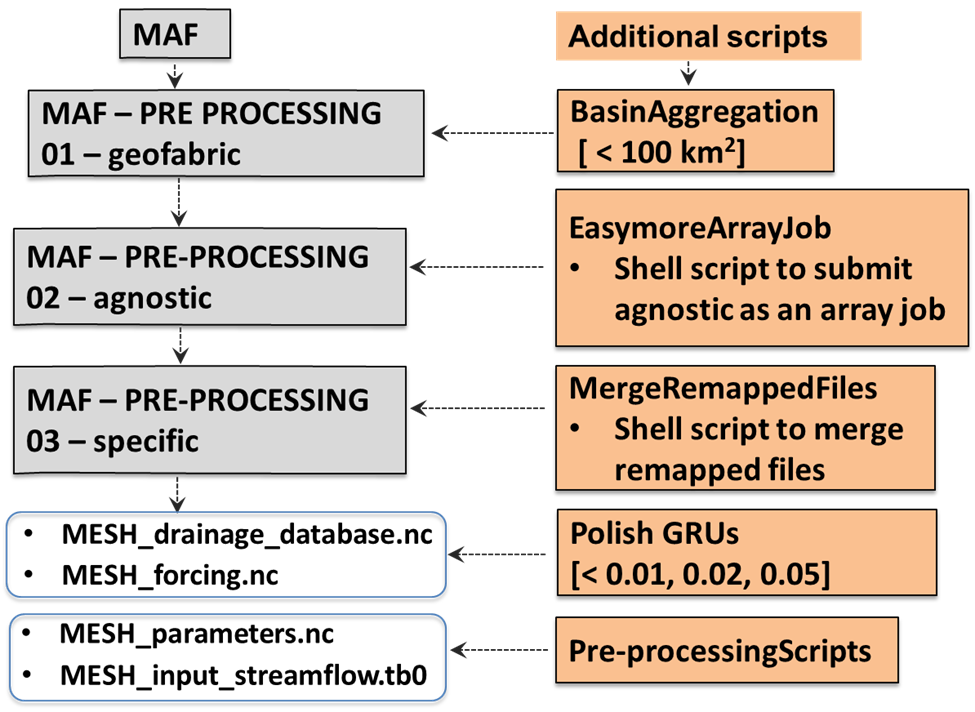

# Lap 0: Model Agnostic Framework – Model Setup

---

## Lap Overview and Objectives

Lap 0 establishes a foundation to the hydrological framework by defining model configuration steps and introducing input datasets. It includes appropriate setup files for the MERIT-Hydro and CLRH geofabrics, as well as documentation and access instructions for additional geospatial and forcing data implemented in future laps. Furthermore, it details scripts and modifications applied to the **Model Agnostic Framework (MAF)**, a reproducible preprocessing workflow developed by Kasra Keshavarz at the University of Calgary. Subsequent Laps reference information provided in this directory.

Model run iterations require a discrete set of input datasets and parameters to function, most of which are provided in Lap 0. Datasets can be divided into two categories, listed below.

### Geospatial Data

- Geofabric
- Landcover
- Soil Information

### Forcing Data

- Atmospheric Model

---

  
*Figure 1: The Model Run Configuration Sequence, Presented in 7 Laps*

---

## Section 2
