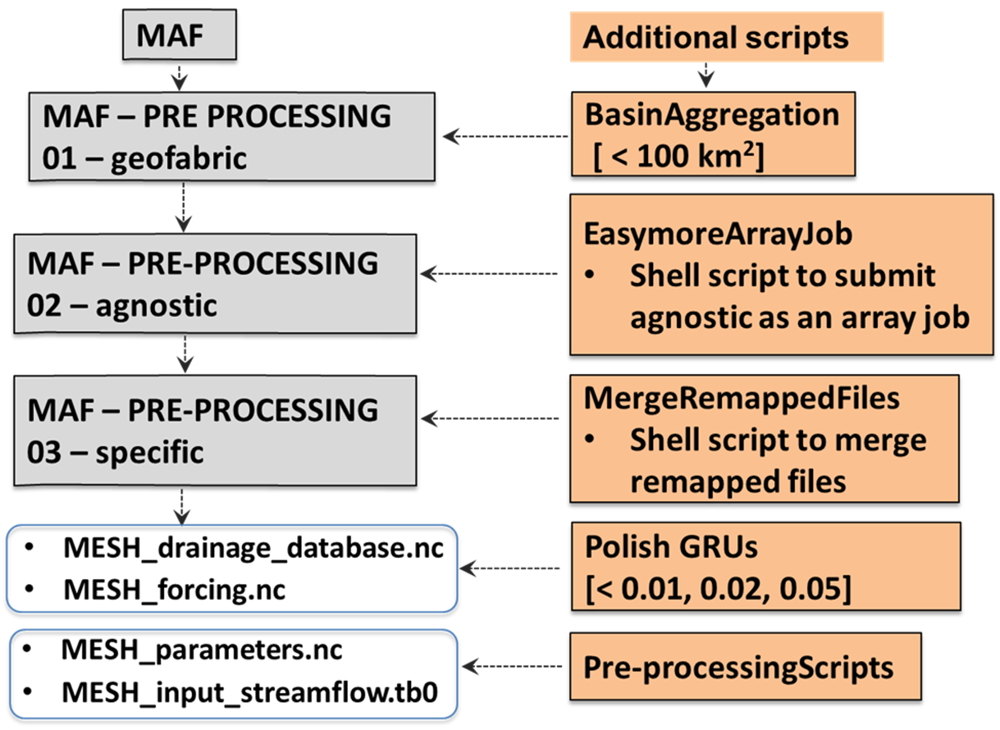

# Lap 0: Model Agnostic Framework – Model Setup

---

## Lap Overview and Objectives

Lap 0 establishes a foundation to the hydrological framework by defining model configuration steps and introducing input datasets. It includes appropriate setup files for the MERIT-Hydro and CLRH geofabrics, as well as documentation and access instructions for additional geospatial and forcing data implemented in future laps. Furthermore, it details scripts and modifications applied to the **Model Agnostic Framework (MAF)**, a reproducible preprocessing workflow developed by Kasra Keshavarz at the University of Calgary. Subsequent Laps reference information provided in this directory.

Model run iterations require a discrete set of input datasets and parameters to function, most of which are provided in Lap 0. Essential datasets for each run can be divided into two categories, listed below.

### Geospatial Data

- **Geofabric (MERIT-Hydro, CLRH, CAMELS-SPAT):** A domain-wide network of subbasin polygons which define basin connectivity, flow routing, lake/reservoir interactions, and provide a baseline for dataset remapping. Constitutes the MESH "grid". Includes stream gauging stations as fixed control points.

- **Landcover Information (NALCMS, ESA WorldCover):** A raster dataset delineating landcover classifications in Canada which are separated into Grouped Response Units (GRUs), parameterized at the sub-grid level. Grid cells include a tile set reflecting the ratio of GRUs within the subbasin, subject to unique land-surface calculations. Landcover has important effects on evapotranspiration, flow rate, and snow accumulation.

- **Soil Information (GSDE, SoilGrids):** Domain-wide raster information including horizon-specific parameters related to soil moisture and type, governing infiltration, baseflow, and runoff dynamics. Aggregated vertically into established depth thresholds, enabling comparability and minimizing dilution of topsoil properties. Assigned to GRUs based on the intersecting average.

### Forcing Data

- **Atmospheric Model (CaSR, ERA5-Land, CMIP):** Nationwide data from ensemble meteorological information systems providing historical and projected values for precipitation, temperature, humidity, pressure, wind speed, and radiation. Variables influence and generate feedback in both the water cycle and the atmospheric energy balance, which are essential components in the MESH model.

## Configuration Workflow – The Model Agnostic Framework (MAF)

An important component of model preprocessing and configuration is the MAF, which ties together the aforementioned datasets into a standardized procedure, ensuring consistency and repeatability. The modular workflow divides the objective into three primary tasks: geofabric preparation, model-agnostic preprocessing, and model-specific configuration. By decoupling preprocessing from model-specific requirements, the procedure enables scalable and systematic incorporation of dataset updates through a High-Performance Computing (HPC) environment.

The NAS project utilizes a range of additional Python scripts in the preprocessing step, including tools for subbasin aggregation and geospatial data remapping. Scripts are available in the corresponding `National-Adaptation-Strategy-NAS-Project/Scripts` directory, and referenced in their respective laps. Details on the MAF structure and script integration are provided in Figure 1. For detailed instructions on setting up and applying the MAF, refer to the [Community Model Workflow Training](https://github.com/CH-Earth/community-modelling-workflow-training).

---

  
*Figure 1: The Model Agnostic Framework Workflow, Including Additional Scripts*

---

## List of Geospatial Datasets

### Geofabrics

- **Multi-Error-Removed Improved Terrain Hydro (MERIT-Hydro):** A high-resolution global hydrology dataset developed at the University of Tokyo which corrects common DEM errors. Global availability makes the dataset well-suited for cross-boundary simulations, but less appropriate at localized scales.

- **Canadian Lake River Hydrofabric (CLRH):** Derived at the University of Waterloo from MERIT-Hydro, the CLRH provides high-quality data at the national scale, tailored for Canadian hydrology and linked with operational gauges from the Water Survey of Canada (WSC). Integration of local datasets and conventions ensure it provides top-quality data, emphasizing Lake-River interactions and connectivity.

- **Catchment Attributes and Meteorology for Large-Sample Spatially Distributed Analysis (CAMELS-SPAT):** Limited to 1426 basins within the domain, CAMELS-SPAT combines the quality of MERIT basins with the gauge-based analysis points of the CLRH, spanning much of North America. Streamflow, atmospheric forcing, and geophysical attributes are also incorporated to support more advanced hydrological studies.

### Land Use

- **North American Land Change Monitoring System (NALCMS):** A standardized 30-meter land cover map for North America which includes 15 unique groups derived from satellite imagery. Cropland, forests, and other classes are inputted into MESH as GRUs. It follows the Land Cover Classification System established by the United Nations.

- **European Space Agency World Land Cover Product (ESA Worldcover):** Global land cover information, distributed into 11 unique types. Suited for comprehensive, transboundary applications, the 10-meter dataset includes satellite-derived classifications such as grassland, herbaceous wetland, and needleleaf forest.

### Soil Data

- **Global Soil Dataset for Earth System Models (GSDE):** A 30-arc-second soil information dataset with eight layers extending to a depth of 2.3 meters. Includes information on soil texture, depth, and hydraulic properties such as conductivity. Parameterized within each GRU to improve computational efficiency.

- **SoilGrids:** A finer-resolution alternative to GSDE, SoilGrids 2.0 provides 250-meter data for six soil horizons extending to a 2.0 meter depth. It includes 14 soil properties, encompassing texture and hydraulics, and is better suited for regions with greater topography and land-surface heterogeneity.

- **Out-of-Box:** Iterations with this description for the soil data use a set of globally-applied soil parameters determined in a previous study. They are independent of GRU, and therefore avoid the preprocessing steps of vertical aggregation and intersect averaging to define properties for distinct landcover types.

## List of Forcing Datasets

### Historic Runs – The Canadian Surface Reanalysis (CaSR)

Runs with interest in historical simulation for model evaluation make use of the **Canadian Surface Reanalysis (CaSR)** system, which provides best-fit information for seven forcing variables: temperature, specific humidity, precipitation, wind speed, atmospheric pressure, and short- and longwave radiation. Early simulations utilize version 2.1, previously known as the Regional Deterministic Reforecast System, derived from the Canadian Precipitation Analysis (CaPA). The 10-kilometer datset is more frequently implemented in its latest forms, CaSR v3.1 and v3.2, which provide improvements to input datasets, model physics, and data assimilation.

### Historic Runs – The European Centre for Medium-Range Weather Forecasts Reanalysis (ERA5-Land)

An alternative dataset used for historical forcing is the **ERA5-Land** product, which is a global tool developed by the European Centre for Medium-Range Weather Forecasts. With improved spatial and temporal resolution, the dataset is useful for hydrological support and benchmarking, and appropriate for zones without specialized regional analyses. On top of the parameters included in CaSR, it provides land-surface parameters such as evaporation, snow, albedo, and lake characteristics.

### Future Runs – The Coupled Model Intercomparison Project (CMIP5/6)

Climate runs considering future data make use of the Coupled Model Intercomparison Project (CMIP) protocol. Within CMIP5, the bias-corrected CanRCM4-WFDEI-GEM-CaPA (CanRCM4-WGC) dataset is built on the RCP8.5 climate scenario. It consists of 15 ensemble members spanning 150 years (ending in 2100). The dataset also contains all seven MESH input variables packaged into a global 3-hour, 0.125° data structure, and is widely applied in climate change studies. CMIP as a project includes multiple atmospheric models, most of which do not meet the necessary requirements to run MESH in the study.

CMIP6 is the most recent phase of the CMIP protocol. Transitioning from an RCP framework to an SSP one, the study selects the Ouranos CRCM5 ensemble dataset within CMIP6. In contrast to CMIP5, it provides information for a range of emission scenarios between SSP1-2.6 and SSP5-8.5. Moreover, on top of including both future and historical data, it improves resolution, which reaches hourly, 0.11° intervals. Two challenges with use of the improved CRCM5-CMIP6 are its lack of availability in a bias-correct format, and the additional preprocessing required to address issues related to leap years.

## Additional Scripts

The NAS project utilizes several tailored scripts to improve computational efficiency and standardize the model workflow. Refer to Figure 1 for their implementation order. Scripts are found in the directory `National-Adaptation-Strategy-NAS-Project/Scripts`, with details listed below.

- `BasinAggregation` – Subbasins in the geofabric are aggregated with the largest upstream basin if they fall below the threshold area of 100 square kilometers, improving computational efficiency.

- `EasymoreArrayJob` – Information not yet available.

- `MergeRemappedFiles` – Information not yet available.

- `PolishGRUs` – Subbasin GRU fractions are zeroed if they fall below a landcover-dependent threshold, and their ratio is redistributed among other LC types. Thresholds are listed below.

| Grouped Response Unit         | Minimum Fraction |
|-------------------------------|------------------|
| Vegetation Land Cover         | 0.05             |
| Wetland, Barren, Urban, Water | 0.02             |
| Glacial                       | 0.01             | 

Maximization of computational efficiency is essential, as running MESH on the CTRB requires intensive calculations which take days, even in an HPC environment. Additional files, such as domain-specific scripts and the `gauge-regulation` program are included in the directory, but not yet implemented in the project. Details for these scripts are not yet available.

## MESH Configuration Parameters

The **Canadian Land Surface Scheme (CLASS)** is a key component of MESH which simulates atmospheric energy fluxes at the grid and sub-grid levels. It depends on a range of input parameters associated with a respective GRU, including vegetation properties, roughness length, and surface albedo. Along with soil properties, the surface parameters are predefined at the configuration level and remain static during the run. CLASS considers vegetation characteristics as time-invariant, and accounts for seasonality using the Leaf Area Index (LAI).

Parameters are defined in the `02_Model_Setup` subfolder of each iteration directory. Details on additional input options, including streamflow, hydrology, and control flags can be found on the [MESH User Wiki](https://mesh-model.atlassian.net/wiki/spaces/USER/overview?mode=global).

## Project Team

- Zelalem Tesemma, Environment and Climate Change Canada (zelalem.tesemma@ec.gc.ca)
- Sujata Budhathoki, Environment and Climate Change Canada (sujata.budhathoki@ec.gc.ca)
- Riley Damen, Environment and Climate Change Canada (riley.damen@ec.gc.ca)
- Frank Seglenieks, Environment and Climate Change Canada (frank.seglenieks@ec.gc.ca)
- Bruce Davison, Environment and Climate Change Canada (bruce.davison@ec.gc.ca)

## Disclaimer
This is an active research repository. Model configurations, parameters, and outputs are subject to change as improvements are made. Please contact the project team before using this material for publications or decision-making applications.
