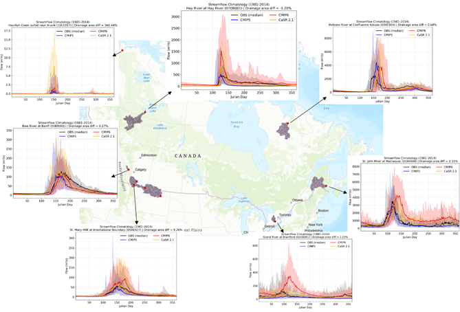

# Lap 1: Initial Diagnostic Analysis – Uncalibrated MESH Runs

---

## Lap Overview and Objectives

Building on the configuration framework developed in Lap 0, Lap 1 conducts preliminary, uncalibrated model runs with the goal of identifying baseline flow behaviour and sensitivity to climate forcing. Under the simplified conditions, a configured MESH setup is expected to generate reasonable streamflow behaviour, enabling the comparison of atmospheric forcing datasets for future decision-making.

In addition to the diagnostic streamflow analysis, Lap 1 uniquely investigates the connection between water balance components (e.g. precipitation and evapotranspiration) and relevant discharge patterns. In doing so, it enables identification of inconsistencies in model response between climate forcings, ensuring data quality. Comparative assessment is also conducted between future and historic datasets.

On top of comparing additional input datasets, future runs focus on parameterization, calibration, and implementation of MESH physics. Without advanced or optimized features enabled, Lap 1 serves to inform subsequent runs, while unsuitable for publication itself. It does not include formal performance evaluation or confidence assessment.

## Datasets Used

Lap 1 consists of 9 iterations which evolve in a stepwise manner. Initial runs of Iterations 1.01 to 1.09 were completed between September 24, 2024 and August 21, 2025. Refer to Lap 0 for details on individual datasets, which are summarized in the table below.

| Iteration | Geofabric   | Landcover | Soils      | Forcing   | Scenario | MESH Version | Period   |
|-----------|-------------|-----------|------------|-----------|----------|--------------|----------|
| 1.01      | MERIT-Hydro | NALCMS    | Out-of-Box | CaSR v2.1 | N/A      | 1860_ME_ZT   | Historic |
| 1.02      | CAMELS-SPAT | NALCMS    | Out-of-Box | CaSR v2.1 | N/A      | 1860_ME_ZT   | Historic |
| 1.03      | CAMELS-SPAT | NALCMS    | Out-of-Box | CaSR v3.1 | N/A      | 1860_ME_ZT   | Historic |
| 1.04      | Benchmark   | NALCMS    | Out-of-Box | CMIP5     | RCP-8.5  | 1860_ME_ZT   | All      |
| 1.05      | Benchmark   | NALCMS    | Out-of-Box | CMIP6     | N/A      | 1860_ME_ZT   | Historic |
| 1.06      | Benchmark   | NALCMS    | Out-of-Box | CMIP6     | SSP1-2.6 | 1860_ME_ZT   | Future   |
| 1.07      | Benchmark   | NALCMS    | Out-of-Box | CMIP6     | SSP2-4.5 | 1860_ME_ZT   | Future   |
| 1.08      | Benchmark   | NALCMS    | Out-of-Box | CMIP6     | SSP3-7.0 | 1860_ME_ZT   | Future   |
| 1.09      | Benchmark   | NALCMS    | Out-of-Box | CMIP6     | SSP5-8.5 | 1860_ME_ZT   | Future   |

## Performance Metrics

Kling-Gupta Efficiency (KGE) and Nash-Sutcliffe Efficiency (NSE) are the primary performance indicators used to evaluate the uncalibrated model results against observational data.

$KGE=1-\sqrt{\left(r-1\right)^2+\left(\frac{\mu_s}{\mu_o}-1\right)^2+\left(\frac{\sigma_s}{\sigma_o}-1\right)^2}\qquad NSE=1-\frac{\Sigma_{t=1}^T\left(Q_o^t-Q_m^t\right)^2}{\Sigma_{t=1}^T\left(Q_o^t-\bar{Q_o}\right)^2}$

## Key Observations

### Historical Runs

Diagnostic analysis of water balance components identified issues related to the reprojection of climate forcing data. Artefacts in the remapped fields were created in the northwest corner of the CTRB, resultant of spatial discontinuities within the authalic projection. The EASYMORE remapping tool caused the discrepancies, which were resolved through a reduction in model domain.

Expected seasonal and geographic patterns were observed in generated streamflow, such as the spring freshet and orographic enhancement. Additional observations supporting preliminary model plausibility include a peak difference between snowmelt and rainfall-dominated regions, alignment of soil moisture with evaptranspiration, and moderate skill levels for KGE and NSE. Timing and variation of streamflow are captured by the model, but heterogeneity of efficiency values point to a sensitivity to subbasin characteristics. Representative stations (such as LIARD RIVER NEAR THE MOUTH) with higher KGE and NSE values will be implemented as benchmarks for future runs.

### Future Runs

Climate change simulations were performed on select Benchmark Basins using CMIP5 and 6, where their responses were evaluated over a range of RCP and SSP emission scenarios. Running the model on historical data generates the correct seasonal structure, allowing confidence in patterns observed when comparing the data with future SSPs. [MORE HERE]

---

  
*Figure 1: Streamflow Climatology Across Select Benchmark Basins*

---

## Project Team

- Zelalem Tesemma, Environment and Climate Change Canada (zelalem.tesemma@ec.gc.ca)
- Sujata Budhathoki, Environment and Climate Change Canada (sujata.budhathoki@ec.gc.ca)
- Riley Damen, Environment and Climate Change Canada (riley.damen@ec.gc.ca)
- Frank Seglenieks, Environment and Climate Change Canada (frank.seglenieks@ec.gc.ca)
- Bruce Davison, Environment and Climate Change Canada (bruce.davison@ec.gc.ca)

## Disclaimer
This is an active research repository. Model configurations, parameters, and outputs are subject to change as improvements are made. Please contact the project team before using this material for publications or decision-making applications.
