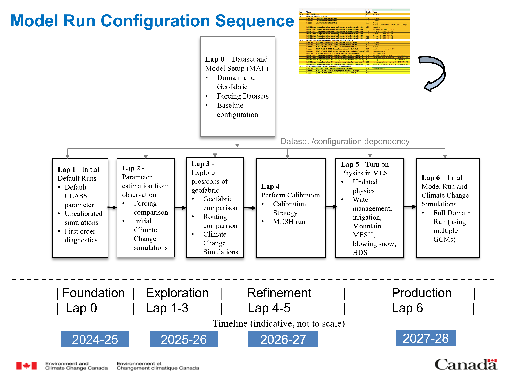

# National Adaptation Strategy (NAS) Project – MESH Model Setup
---
## National Adaptation Strategy (NAS) – Hydrological Modeling

This repository contains the hydrological modeling setup and metadata for the **National Adaptation Strategy (NAS) Project** initiative led by **Environment and Climate Change Canada (ECCC)**. The project aims to support climate resilience and evidence-based adaptation by generating large-scale hydroclimate data and modeling future water availability across Canada's Transboundary River Basins (CTRB).

It utilizes the **Modélisation Environnementale Communautaire-Surface & Hydrology (MESH)** hydrological model, a powerful framework which simulates key surface and cold-region processes at regional and continental scales. Key simulated processes within MESH include streamflow, soil moisture-runoff dynamics, evapotranspiration, and snow accumulation. Results form the foundation for assessing future climate change impacts on water resources in CTRB. 

Project work is organized into a series of phases referred to as **Laps**, presented in Figure 1. Each Lap expands on work developed in its predecessors through grouped exploration of input datasets, implementation of features and processes, and comparison with developed benchmarks. The iterative framework ensures continual improvement while controlling critical variables, ensuring integrity, reliability, and completeness.

Lap 0 starts with detailed documentation of a range of input geospatial and atmospheric forcing inputs, which are reused in future laps to minimize the extent of large-scale data processing. Details for each Lap are provided within each subdirectory, and summarized in `Configuration_Sequence.csv`

---

  
*Figure 1: The Model Run Configuration Sequence, Presented in 7 Laps*

---

## Project objective and Scope

The objective of the NAS hydrological modelling project is to produce credible, regional-scale projections of future water availability across Canada under multiple climate scenarios.
Key components include:

- Continental-scale MESH simulations across all Canadian and transboundary river basins

- Historical forcing using CaSR v2.1 and CaSR v3.1/3.2 datasets

- Climate-change simulations using CMIP5 and CMIP6 global climate models (e.g., CanESM5)

- Evaluation of streamflow, evapotranspiration, snow processes, soil moisture, and runoff

These outputs support federal, provincial, and cross-border water-management planning.

## Configuration Workflow – The Model Agnostic Framework (MAF)

It is important that the conducted research is transparent, physically consistent, and reproducible. Therefore, the repository includes detailed model configurations, metadata, and preliminary outputs from historical and climate-change simulations using the MESH hydrological model.

A modified approach to the **Model Agnostic Framework (MAF)** developed by Kasra Keshavarz is applied, which organizes preprocessing and configuration steps into a repeatable workflow. By decoupling preprocessing from model-specific requirements, the procedure enables scalable and systematic incorporation of dataset updates through a High-Performance Computing (HPC) environment. Details on the MAF are provided in Lap 0.

## Study Domain and Dataset

The study domain encompasses all of CTRB, including basins which span the Canada–United States border.

Key transboundary systems include:

- Columbia River Basin
- Yukon River Basin
- Mackenzie-Peace-Liard Basin
- St. Mary-Milk River Basin
- Red-Assiniboine River Basin
- Great Lakes-St. Lawrence Basin
  
The domain reflects the geographical and hydrological diversity of Canada's river systems, emphasizing those of binational importance. A map of the river basins is provided in Figure 2.

---

  
*Figure 2: Canada's River Basins and Transboundary Systems with MERIT-Hydro Geofabric (before and after Aggregation)*

---

## Model Cases and Repository Structure

This repository includes multiple configurations (based on the Configuration Sequencing Strategy) of the MESH hydrological model as part of the initial NAS project analysis:

- **Lap_0** - Model Agnostic Framework (MAF) model setup
  Baseline hydrological framework for establishing the national MESH domain.
- **Lap_1** - Out-of-box parameter MESH runs on version 1860_ME_ZT
	- **Iterations 1.01–1.03** - Uncalibrated MESH runs using CaSR v2.1 and CaSR v3.1 forcing
	- **Iterations 1.04–1.09** - Initial climate-change simulations on the benchmark basin using CMIP6 (CanESM5)
- **Lap_2** - Parameters estimation from available data [MODIS LAI, Soil, DD, SDep]
	- **Iterations 2.01–2.06** - Lumped/distributed MESH runs using CaSR v2.1 and CaSR v3.1
	- **Iterations 2.07–2.11** - Climate-change simulations for the full Canada and transboundary domain using CMIP6 (CanESM5)

Iteration folders contain additional metadata and documentation, appropriate setup files, select simulation results, and references to additional files used for model setup, including preprocessing scripts and forcing data. Files exceeding the upload limit of 100 MB are stored elsewhere, and provided upon request.

## Project Team

- Zelalem Tesemma, Environment and Climate Change Canada (zelalem.tesemma@ec.gc.ca)
- Sujata Budhathoki, Environment and Climate Change Canada (sujata.budhathoki@ec.gc.ca)
- Riley Damen, Environment and Climate Change Canada (riley.damen@ec.gc.ca)
- Frank Seglenieks, Environment and Climate Change Canada (frank.seglenieks@ec.gc.ca)
- Bruce Davison, Environment and Climate Change Canada (bruce.davison@ec.gc.ca)

## Disclaimer
This is an active research repository. Model configurations, parameters, and outputs are subject to change as improvements are made. Please contact the project team before using this material for publications or decision-making applications.

