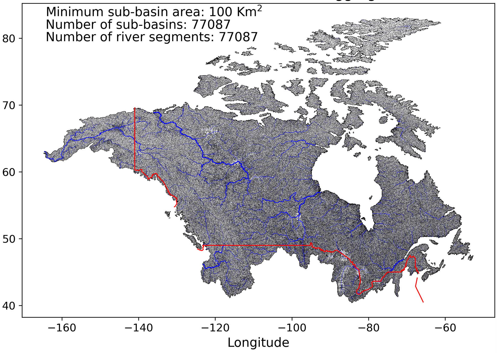

# National Adaptation Strategy (NAS) Project – MESH Model Setup

## Model Cases

- **Lap0_Base case_0_0**: Run with uncalibrated parameters  
- **Lap0_Base case_0_01**: GRU parameterization  
- **Lap0_Base case_0_02**: Distributed parameterization  

---

## Objective and Scope

The objective of this project is to generate accurate, regional-scale projections of hydroclimate variables under various climate change scenarios.

This preliminary MESH run offers valuable insights into current hydrological conditions across Canada’s transboundary basins, focusing on simulating surface water processes, including:

- Streamflow
- Evapotranspiration

This covers:
- Initial setup and execution of the MESH model using historical climate data
- Model setup metadata and output

---

## Study Domain and Dataset

The study domain encompasses all of Canada’s river basins, including **Transboundary River Basins (CanTrans)** that span the Canada–United States border.

Key transboundary systems include:

- Columbia River Basin
- Yukon River Basin
- Mackenzie River Basin

  
*Figure 1: Canada's river basins and transboundary systems*

---

